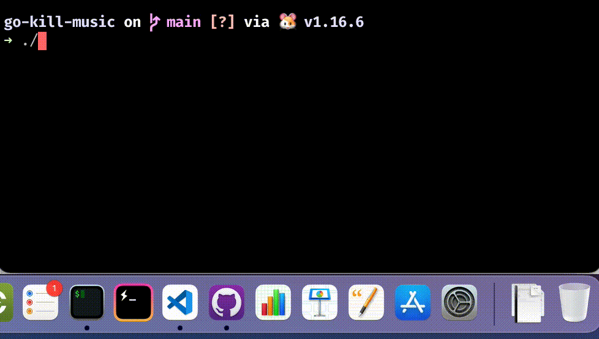

# Go kill Music

A command line tool written in [Go](https://go.dev/) for killing the Apple Music app process when it is randomly starting.

### Credits

- [wesbos/iTunes-Sniper](https://github.com/wesbos/iTunes-Sniper)
- [KrauseFx/overkill](https://github.com/KrauseFx/overkill)

### Disclaimer

This script polls the active process list every second. So it's meant as a joke, not a serious solution. You might want to use [Overkill for Mac](https://github.com/KrauseFx/overkill-for-mac).

## License

Unlicense
